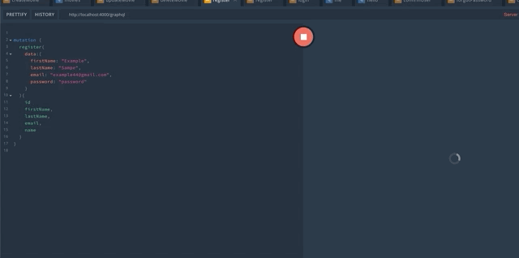

# Apollo Express Type GraphQL Server + Redis

This API is used as a starter kit for all type-graphql APIs.
The tech stack used is:

- Node.JS
- GraphQL
- Apollo Express
- TypeORM
- Postgres SQL
- Redis
- Type-GraphQL
- TypeScript
- Node Mailer
- Bcrypt.JS

&nbsp;



## Installation

in order to install make sure you have the following installed:

- [Redis](https://medium.com/@petehouston/install-and-config-redis-on-mac-os-x-via-homebrew-eb8df9a4f298) 
- [PostgreSQL](https://postgresapp.com/)

#### 1. Create a DB and add credentials inside a .env file in the root directory
```bash
USERNAME=<YOUR_USERNAME>
PASSWORD=<YOUR_PASSWORD>
DATABASE=<YOUR_DB>

TEST_USERNAME=<YOUR_TEST_USERNAME>
TEST_PASSWORD=<YOUR_TEST_PASSWORD>
TEST_DATABASE=<YOUR_TEST_DATABASE>

REDIS_SECRET=<YOUR_REDIS_SECRET>
```
#### 2. If you are using a local redis server, boot up your instance
```bash
redis-server
```

#### 3. Install Dependencies
```bash
yarn
```

#### 4. Run Server
```bash
yarn start
```

## Testing

In order to run unit tests run the following:
```node
yarn test
``` 

## GraphQL Upload

In order to run the GraphQL upload functionality the following is a sample cURL command you can utilise:

```bash
curl --location --request POST 'localhost:4000/graphql' \
--form 'operations="{\"query\": \"mutation AddProfilePicture($picture: Upload!) { addProfilePicture(picture: $picture)}\"}"' \
--form 'map="{ \"0\": [\"variables.picture\"] }"' \
--form '0=@"/<YOUR_FILE_DIRECTORY>/cutie-pie.jpg"'
```

## License
[MIT](https://choosealicense.com/licenses/mit/)